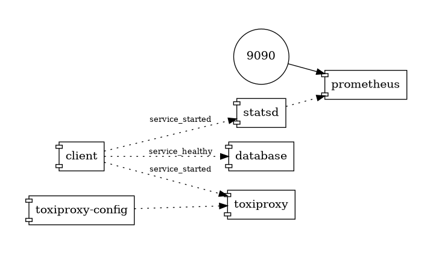
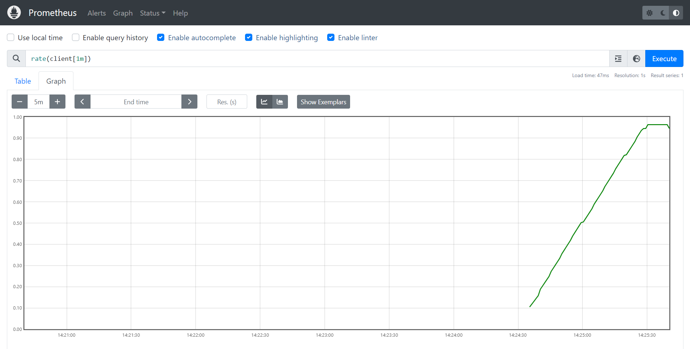
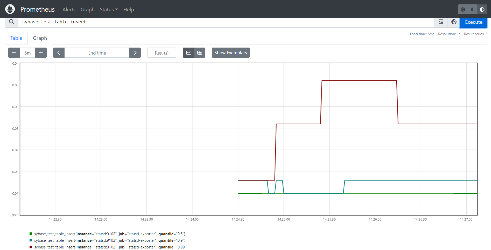
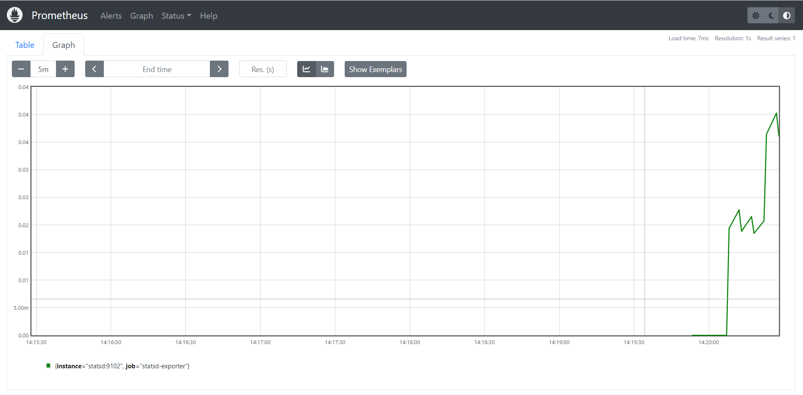
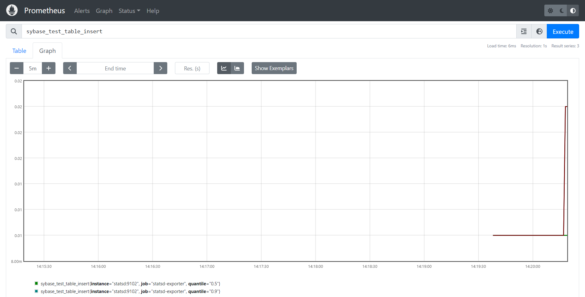

# Chaos testing with toxiproxy

This setup uses toxiproxy as a middleware between client and database to simulate latency, bandwidth and variation problems at TCP level.

The client service uses toxiproxy service as a sybase database which integrates toxic issues and forward tcp packets to the database service (sybase server).

[Docker compose file](./compose.yml)

Prometheus 
[dashboard](http://localhost:9090/graph?g0.expr=rate(client%5B1m%5D)&g0.tab=0&g0.stacked=0&g0.show_exemplars=0&g0.range_input=1h&g1.expr=sybase_test_table_insert&g1.tab=0&g1.stacked=0&g1.show_exemplars=0&g1.range_input=1h) is used to analyze metrics from statsd:

The ``client`` is a counter from the client point of view while ``sybase_test_table_insert`` is a timer from the server point of view.

## Example without Toxics (direct)

## Example with Toxics
We can see that the that from the client point of view the rate is lower than before (1rps > 0.04rps).

## Tools

### Toxiproxy

[Project Page](https://github.com/Shopify/toxiproxy)

### Prometheus

[Dashboard](http://localhost:9090/graph?g0.expr=rate(client%5B1m%5D)&g0.tab=0&g0.stacked=0&g0.show_exemplars=0&g0.range_input=1h&g1.expr=sybase_test_table_insert&g1.tab=0&g1.stacked=0&g1.show_exemplars=0&g1.range_input=1h)